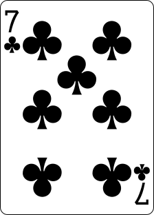
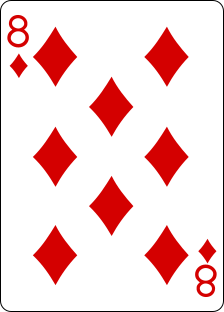
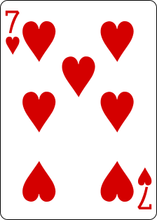
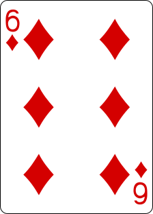
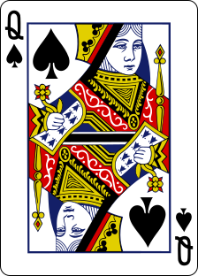
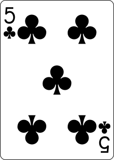

## Blackjack (Juego en GitHub Readme)
Pon a prueba tu suerte y estrategia en este clásico juego de cartas. Tu objetivo es acercarte lo más posible a 21 sin pasarte.

Elige tu acción:
- Pedir 🎴: Roba otra carta.
- Plantarse 🛑: Mantén tu mano actual.
- Nuevo Juego 🔄: Inicia una nueva partida y limpia el tablero.

¿Listo para jugar? Haz clic en uno de los botones de abajo para realizar tu jugada y enviar tu elección! 🍀

<!-- blackjack-area -->

## Repartidor

<table>
  <tr>
    <th></th>
    <th>Carta #1</th><th>Carta #2</th><th>Carta #3</th>
    <th>Resumen</th>
  </tr>
  <tr>
    <td><strong>Cartas</strong></td>
    <td align="center"></td><td></td><td></td>
    <td align="center">❌</td>
  </tr>
  <tr>
    <td><strong>Valores</strong></td>
    <td align="center">7</td><td align="center">8</td><td align="center">7</td>
    <td align="center">22</td>
  </tr>
</table>
  

## Jugador

<table>
  <tr>
    <th></th>
    <th>Carta #1</th><th>Carta #2</th><th>Carta #3</th>
    <th>Resumen</th>
  </tr>
  <tr>
    <td><strong>Cartas</strong></td>
    <td align="center"></td><td></td><td></td>
    <td align="center">✔️</td>
  </tr>
  <tr>
    <td><strong>Valores</strong></td>
    <td align="center">6</td><td align="center">10</td><td align="center">5</td>
    <td align="center">21</td>
  </tr>
</table>
  

## Historial del Juego
| Acción | Eventos | Actor |
| ------ | ------ | ----- |
| Nuevo Juego || <a href='https://github.com/tadanobutubutu'>tadanobutubutu</a> |
| Pedir || <a href='https://github.com/tadanobutubutu'>tadanobutubutu</a> |
| ↳ | Jugador: Roba carta ||
| ↳ | Repartidor: Roba carta ||
| ↳ | Jugador ganó: Repartidor se pasó ||
| ↳ | Repartidor: Revela carta oculta ||
| ↳ | Juego terminado: ¡Gracias por jugar! ||

<!-- /blackjack-area -->

##

### Comandos del Juego

###

¿Cómo funciona?

Al hacer clic en un enlace, se creará y enviará un nuevo issue de GitHub con la acción deseada. Esta acción activa un flujo de trabajo de GitHub, que ejecuta un pequeño script de Typescript responsable de realizar la acción especificada en el juego de blackjack. El script luego actualiza el contenido del archivo README para reflejar el estado actual del juego y confirma los cambios de vuelta al repositorio.

Preguntas/Errores/Ideas

Si tienes alguna pregunta, encuentras algún error o tienes ideas para mejorar el juego, simplemente puedes crear un issue y mencionarme.

